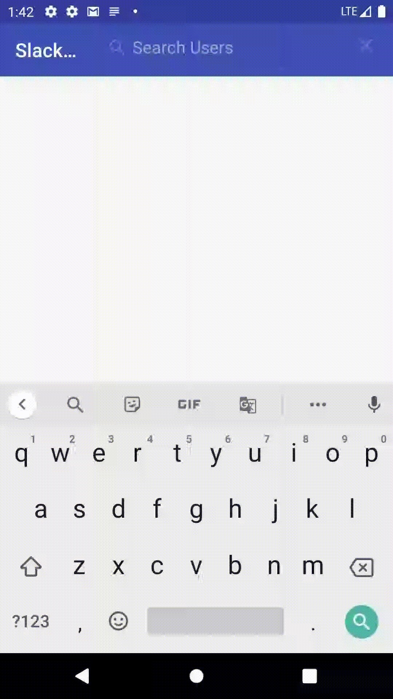

# android-code-exercise
Slack project for the coding exercise for Android candidates. The problem consisted of displaying search results for a slack user search, as well as optimizing the search functionality and implementing a denylist.

Below are details regarding each of the 3 requested enhancements made to the app.

## Performance Optimization

The basic implementation of the app called a search API endpoint on every keystroke, which was not performant. To optimize this, I made 2 changes:
1. Add a **caching** layer to the retrofit instance
    - Implementation: added a cache to retrofit and a network interceptor which adds a cache control header
    - Notes: I set the cache's max time to 1 minute. The thought process was that if the user types characters and then deletes some, we get a cache hit rather than making the same network call again with the same query.
2. Add a **throttle** to the search query listener
    - Implementation: used `throttleLatest` from rxJava, which emits the first item, and then periodically emits the latest item after a specified period of time (in this case, 1.5 seconds) elapses
    - Notes: Some other options were `debounce`, `throttleFirst` and `throttleLast`, but `throttleLatest` felt like the right choice because it allows the user to see results as fast as possible because it emits the first item. However, it still throttles subsequent keystrokes such that we only make an API call when the user pauses or a significant portion of the search term has been typed out.

## UI Spec Implementation

Implemented UI based off of the given UI specs. A few things to call out:
* I switched the view holder's layout to a ConstraintLayout in order to accommodate the divider without creating a nested layout.
* I used Glide for image loading, as it is faster than similar libraries such as Picasso and Coil, and includes built-in caching and easy transformations, including the requested rounded corners.
* Heads up that the design spec requested a 4dp corner radius for the avatars, but the corners were much sharper than the given design, so I set it to 8 instead. Normally, I would likely have reached out to design to confirm the desired radius.

## Denylist Implementation

To implement the denylist, I decided to go with the Trie approach. A Trie is a type of tree commonly used for prefix matching, which has a node for each character in a string. 

A Trie is a performant choice because searching for a prefix match has O(k) complexity, where `k` is the length of the longest string, rather than O(log n) in common search algorithms, where n is the number of strings. In my implementation, we first have to load all n strings into the trie, but once that is complete, each lookup is a more efficient O(k).

One tradeoff I considered was whether to persist the updated Trie across app sessions in some way. This means that any additional values we have added to the denylist would still be present across app sessions. However, I decided that ultimately, it wouldn't make sense to persist the denylist, because if a new user is added between sessions, we wouldn't want a now-valid search term to be found in the denylist. 

Had I chosen to persist the Trie, I likely would've gone with SharedPreferences, as that is the simplest way to persist a json object. However, for scalability reasons, it would probably make more sense to use a Room/SqlLite database to store the TrieNodes if I had more time.

## Additional Enhancements

One additional enhancement I decided to make to the app was a simple error and empty state. This allows for better transparency to the user as to what went wrong. I merely did this by modifying the visibility of views within the fragment, but I would normally opt for a ViewFlipper or similar implementation instead, to avoid visibility-setting mistakes.

One thing to note is that with the given implementation, the error state is impossible to get out of without restarting the app, because it's caused by an exception that terminates the observable. One way to fix this is by adding an interceptor to Retrofit that handles errors and transmits them as a success downstream (for example, a sealed class with Success and Error options). The default implementation of Retrofit treats network errors as an exception.